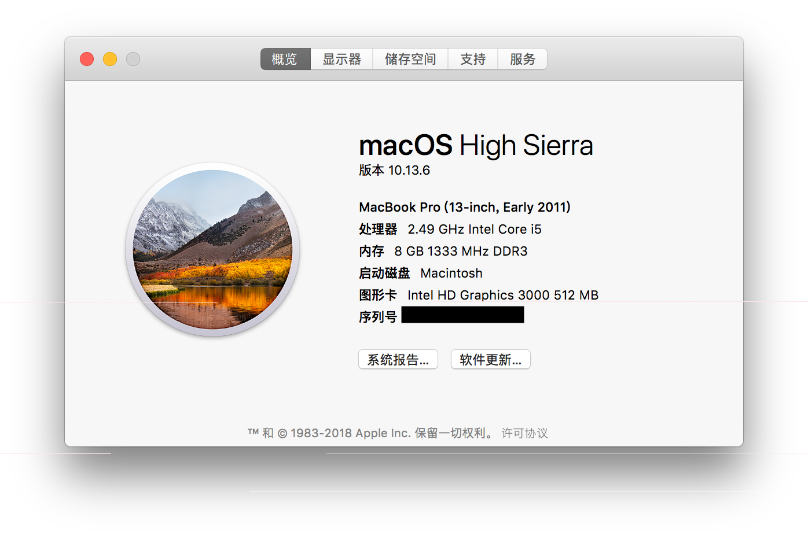

# The config of Hackintosh for Lenovo G470 (macOS High Sierra 10.13.6)

## 一、正常工作的：

1. 集成显卡(Intel HD Graphics 3000)

2. 有线网卡(Qualcomm Atheros AR8152)

3. 无线网卡(Atheros AR9285)（注：若无效请搜索AR9285的驱动方式）

4. 声卡(Conexant CX20590)（注：准备了VoodooHDA和AppleALC两种驱动方式，根据个人喜好选择，VoodooHDA请在设置面板内调整并加入VoodooHDA SettingsLoader，AppleALC下麦克风无输入电平）
5. 睡眠可进入且不会自动唤醒/睡死，原生电源管理已加载
6. 电源电量显示且可在显示器页面调整亮度，触控板已驱动

## 二、已知问题：

1. 无法合盖睡眠，小太阳暂时不可用
2. 独立显卡(ATI Raedon HD 6370M)未使用dsdt屏蔽，安装前请在BIOS内屏蔽
3. SSDT文件是根据i5 2450M来生成的，若非i5 2450M，请用ssdtPRGen.sh重新生成

## 三、使用方式：

正常安装macOS High Sierra 10.13.6后将该配置文件夹复制到/Esp/EFI/Clover后重启

## 四、图片：

By Sakura Mitsuha